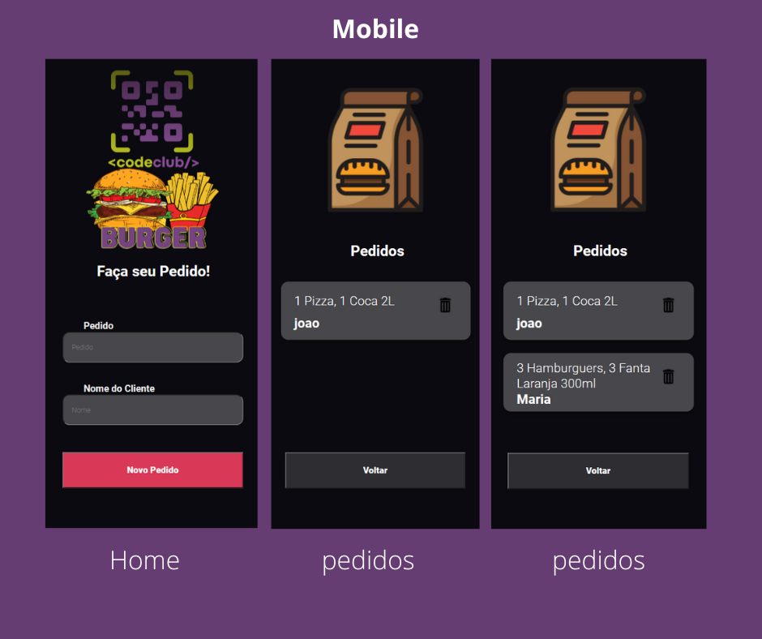
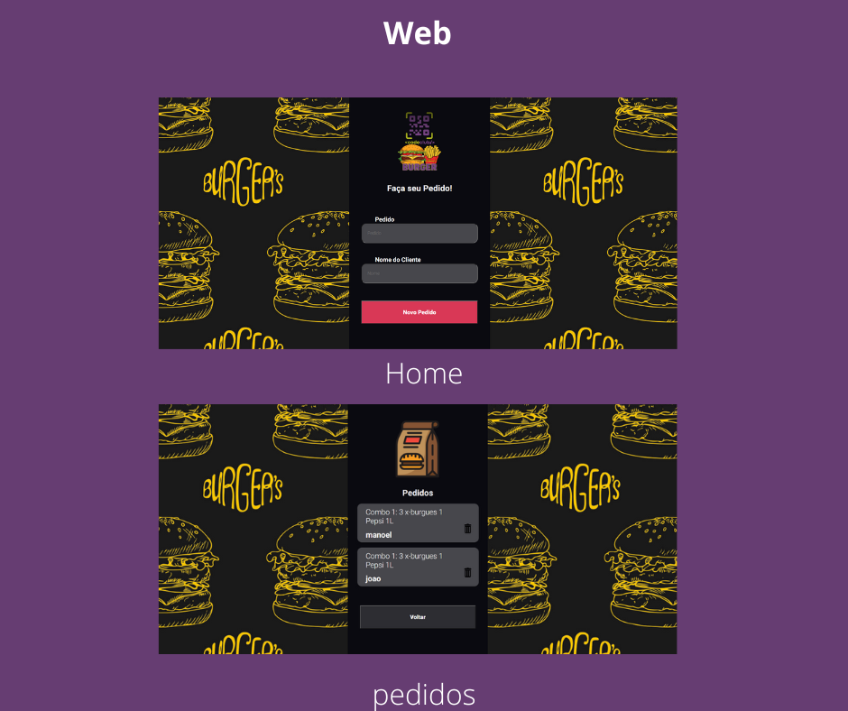

# CodeBurguer - Frontend

> Resultado do projeto CodeBurguer - Frontend Web.

> Resultado do projeto CodeBurguer - Frontend Web.

## Ajustes e melhorias

O projeto trata-se de uma tela de pedidos de uma Hamburgueria, onde é possível cadastrar o pedido e o nome de usuário.
 A aplicação possui:

- [x] Criação do React
- [x] Criação do Styled-components
- [x] Conexão com API
- [x] Responsividade

## 🤝 Colaboradores

Agradecemos às seguintes pessoas que contribuíram para este projeto:

<table>
  <tr>
    <td align="center">
      <a href="#">
         
        
          <b>Vagner Santos</b>
        
      </a>
    </td>
  </tr>
</table>
